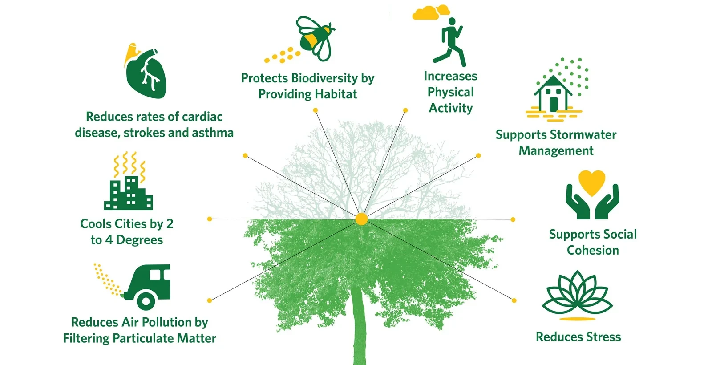
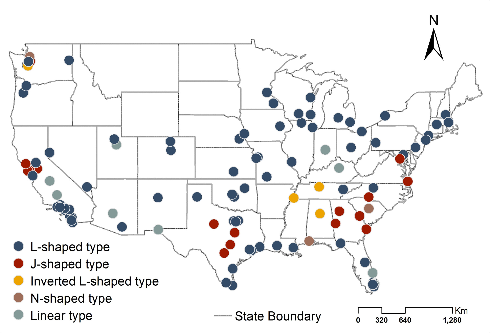
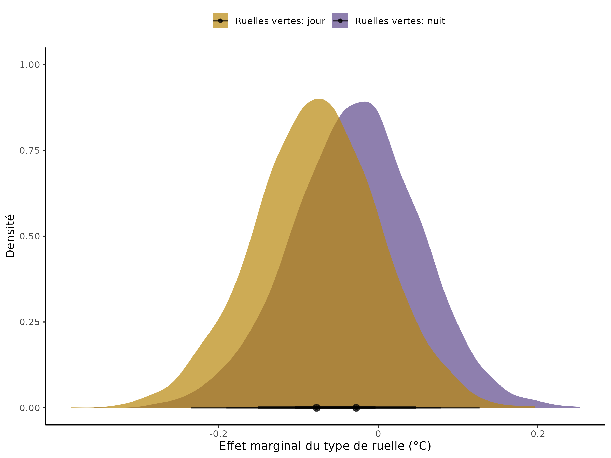
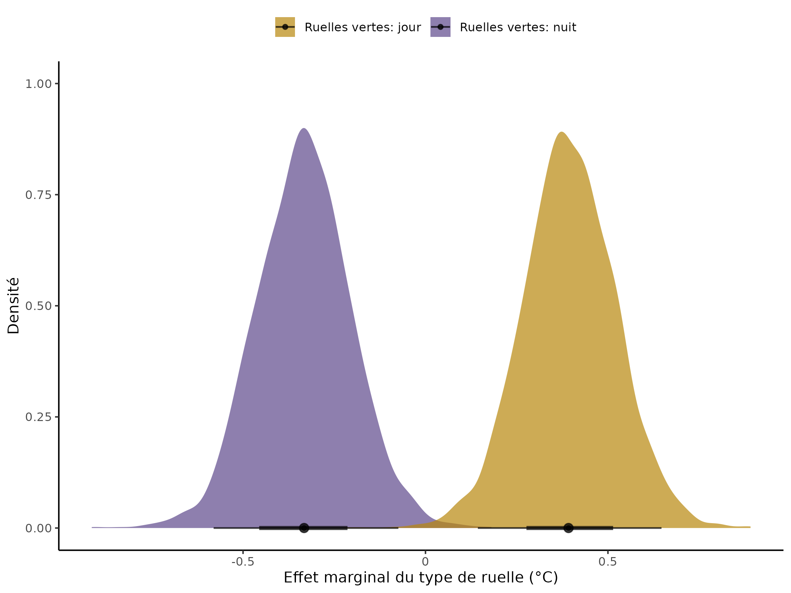

## Thank you!

::: fragment
{.absolute top="50" left="0"
width="400" height="400"}

{.absolute bottom="0" left="50"
width="400" height="350"}

{.absolute top="25" right="150"
width="450" height="400"}

{.absolute bottom="0" right="50"
width="300" height="400"}
:::

::::::: fragment
:::::: {layout="[[-1], [1], [-1]]"}
::::: columns
:::: {.column width="90%"}
::: {style="background-color: #c0c0beff; opacity: 80%"}
-   Carly & the ZULE lab

-   Committee members & examiners

-   Collaborators at UQAM, UdeM, Organisme Respire, UBC, McGill, MUN,
    uOttawa

-   Alec, Laura, Andrew, Anne-Sophie, and many more!

-   My friends and family
:::
::::
:::::
::::::
:::::::


## Nature is a key part of our cities

Nicole

::: notes
-   the integration of nature with the built environment creates novel
    ecosystems
-   requires inter and trans disciplinary studies to be understood
:::


## There are many benefits of urban nature, which are disproportionately provided by trees {.smaller}



::: notes
-   ecosystem services - regulating & cultural
-   vary across spatial and temporal contexts
:::


## These benefits are not equitably distributed

::::: columns
::: {.column width="50%"}
{width="350" height="475"
fig-align="center"}
:::

::: {.column width="50%"}
{width="450" height="450"
fig-align="center"}
:::
:::::

::: notes
-   decisions were made in the past, continue to affect our cities
-   affected by urban form and spatial context
:::


## Spatial patterns in nature's benefits are present at both small and large scales




## My goals

:::: incremental 
::: {style="font-size: 150%;"}


1.  Integrate temporal heterogeneity and historical conditions

2.  Use interdisciplinary approaches and perspectives 

3.  Assess benefits of understudied types of green infrastructure 

4.  Contribute a multi-scale, cross-city study to the Canadian urban ecology literature
:::
::::


## Chapter 1: Land-use history causes differences in park nighttime cooling capacity and forest structure {.smaller}

::::::: {layout="[[-1], [1], [-1]]"}
:::::: columns
::: {.column width="33%"}
{fig-align="left"}
:::

::: {.column width="33%"}
{fig-align="center"}
:::

::: {.column width="33%"}
{fig-align="right"}
:::
::::::
:::::::

::: notes
-   cities are temporally dynamics
-   the redevelopment of urban spaces is a social process
:::


## We asked:

:::: incremental
::: {style="font-size: 150%;"}
1.  What are the effects of historical land-use on current park forest
    structure, diversity, and consequently the capacity to provide
    cooling?
2.  How do surrounding communities differ around parks of each
    historical land-use type, and what are the implications for
    equitable access to cooling?
:::
::::


## We uncovered the history of parks around Montréal

::: r-stack
{.fragment
width="80%" fig-align="center"}

{.fragment width="50%"
fig-align="center"}
:::


## We sampled temperature, forest structure, and population demographics in and around 27 parks {.smaller}

{fig-align="center"}


## Past land-use affects park cooling capacity

{fig-align="center"}


## Past land-use affects forest structure

{fig-align="center"}


## Forest structure affects cooling

{fig-align="center"}


## The Luxury Effect surrounds our parks

:::::::: incremental
:::: columns
::: {.column .center}
**Across all parks:**

-   [⬆]{style="color:#CFA35E;"} level of education
-   [⬇]{style="color:#45A291;"} visible minorities
:::
::::

::::: columns
::: {.column width="50%"}
Forested 🌲 and agricultural 🌾

-   [⬆]{style="color:#CFA35E;"} median annual salary
-   [⬆]{style="color:#CFA35E;"} single family homes
:::

::: {.column width="50%"}
Industrial 🏭

-   [⬇]{style="color:#45A291;"} median annual salary
-   [⬇]{style="color:#45A291;"} single family homes
:::
:::::
::::::::


## Put parks everywhere! ... with intentional, community led approaches

::::: columns
::: {.column width="50%"}
-   Historical data provides useful ecological context

-   Parks have the capacity to provide cooling, regardless of historical
    land-use

-   To improve environmental equity, green space development must be
    community led and paired with stronger housing regulations
:::

::: {.column width="50%"}
{fig-align="right"}

{fig-align="right"}
:::
:::::


## Chapter 2: Green alleys in Quebec provide variable biodiversity support and ecosystem services {.smaller}

## Résultats des entretiens

::::: columns
::: {.column width="40%"}
-   19 services écosystémiques ont été mentionnés
-   Plusieurs d'entre eux sont culturels
:::

::: {.column width="60%"}
```{r}
#| echo: false
#| eval: true
#| warning: false
#| message: false
#| label: table-s3

library(scales)
library(dplyr)
library(flextable)

interviews <- read.csv('presentation_imgs/es_coding.csv') %>% 
  select(-c(TotalPeopleMentions))

t <- col_bin("Greens", domain = 0:75)

interviews %>% 
  arrange(desc(TotalMentions)) %>% 
  flextable() %>% 
  bg(
    j = c("TotalMentions"),
    bg = t, part = "body"
  ) %>% 
  set_header_labels(
    EcosystemService = "Service écosystémique",
    TotalMentions = "Nombre total de mentions"
  ) %>%
  set_table_properties(
    opts_html = list(
      scroll = list(
      height = "500px",
      freeze_first_column = TRUE))
  ) %>% 
  fontsize(size = 18, part = 'all')


```
:::
:::::

## 

**Les ruelles vertes présentent des niveaux similaires ou supérieurs de
soutien de la biodiversité que les ruelles grises**

{fig-align="center"}

## 

**Les ruelles vertes présentent des niveaux similaires ou inférieurs de
services écosystémiques que les ruelles grises**

{fig-align="center"}

## L'atténuation de la température est variable à Montréal

::: r-stack
{fig-align="center" width="70%"}

{.fragment fig-align="center"
width="60%"}
:::

::: notes
-   Maintenant on examine une service écosystémique: l'atténuation de la
    température
-   Ici, l'axe y est l'effet de refroidissement, donc un numero positif
    indique que la ruelle verte est plus fraiche qu'une ruelle
    traditionelle. Par contre, si l'effet de refroidissement est
    negative, la ruelle verte est plus chaud qu'une ruelle
    traditionelle.
-   Le graphique au gauche est pendant le jour et le graphique au droit
    est pendant la nuit, chaque ligne est une ruelle verte differente
-   Ici il y a beaucoup de variation -- des lignes dessus et dessous
    zero
-   Mais, certains d'entre vous savent deja, les ruelles vertes à
    Montréal sont très variable
-   Certains sont très verts, comme la ruelle au gauche ici -- avec
    quelques arbres, arbustes, et gazon. Mais certains sont un peu gris,
    comme la ruelle au droit avec quelques boites du plantes
-   En fait, les resultats de l'attenuation de la température ont raison
:::

## À Trois-Rivieres, les ruelles vertes rafraîchissent la nuit

::::: columns
::: {.column width="70%"}
{fig-align="left"}
:::

::: {.column width="30%"}
{fig-align="right"}
:::
:::::

::: notes
-   Mais, quand on voit l'attenuation de la température à TR, c'est
    possible de voir une tendance. Pendant le jour, la majorité des
    ruelles vertes sont plus chaud que les ruelles traditionelles. Mais
    dans la nuit, la tendance s'inverse et la majorité des ruelles
    vertes sont plus fraiches que les ruelles traditionelles
-   Les ruelles vertes à TR sont differentes que les ruelles vertes à
    Montréal. Ils sont gèrer par la ville, donc elles ont tous la même
    apparence comme la photo ici.
:::

##  {background-image="presentation_imgs/dogwood.png"}

::::: columns
:::: {.column width="90%"}
::: {style="background-color: #c0c0beff; opacity: 80%"}
**Points à retenir**

-   Les ruelles vertes offrent des bénéfices importants

-   Les différents types de gestion ont des bénéfices différents

    -   Montréal est plus variable mais aussi plus flexible
    -   TR est moins variable mais moins apte à s'adapter aux besoins de
        la communauté

-   Actuellement, le soutien de la biodiversité est plus haut que les
    services écosystémiques dans nos ruelles **pour les bénéfices
    fournis par les arbres**
:::
::::
:::::

::: notes
-   Some takeaways from our work:
-   Its certain that green alleys have important benefits, some of which
    we measured in our study but many of which we didn't
-   Not all alleys are providing the same level or types of benefits,
    and different management has different outcomes
-   Montreal had more variable levels of the benefits we measured but
    also because they are resident led they are much more adaptable t o
    the needs of the community
-   On the other hand, TR green alleys have a lot less variation but
    cannot adapt to the needs of their community
-   Finally, right now we are seeing that our alleys have higher levels
    of biodiversity support than ecosystem services when talking about
    tree-based benefits
:::
