## Thank you!

::: fragment
{.absolute top="50" left="0"
width="400" height="400"}

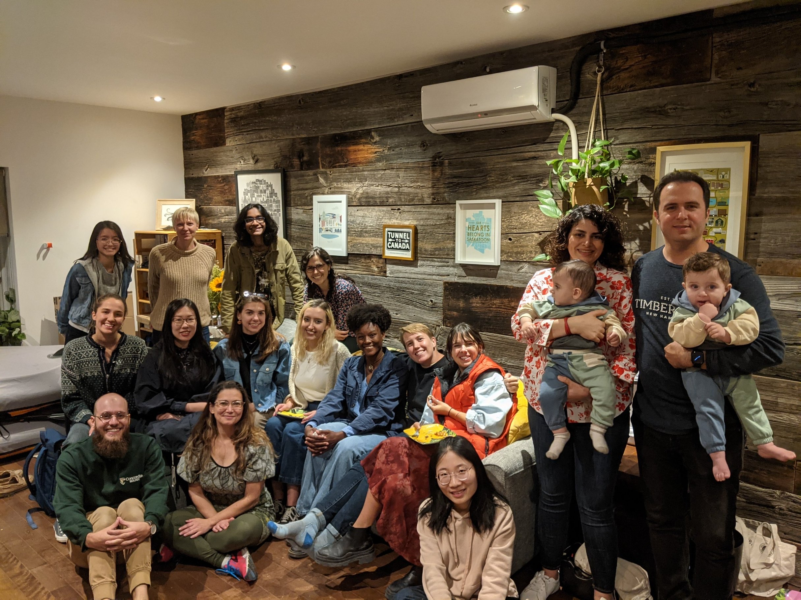{.absolute bottom="0" left="50"
width="400" height="350"}

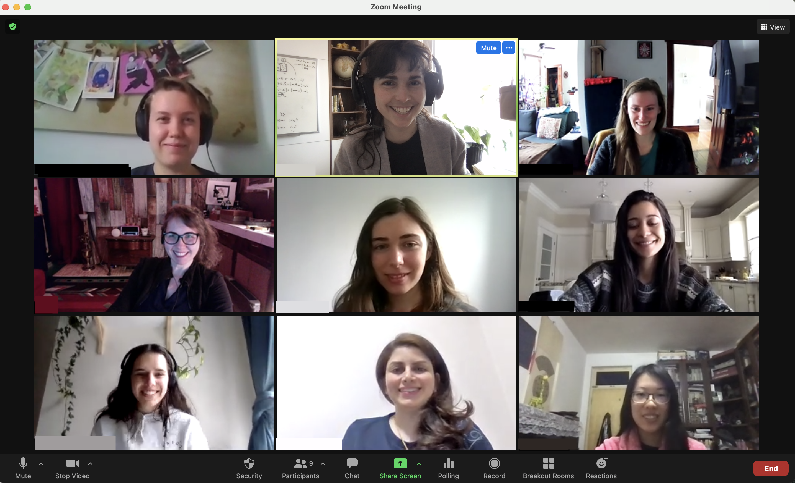{.absolute top="25" right="150"
width="450" height="400"}

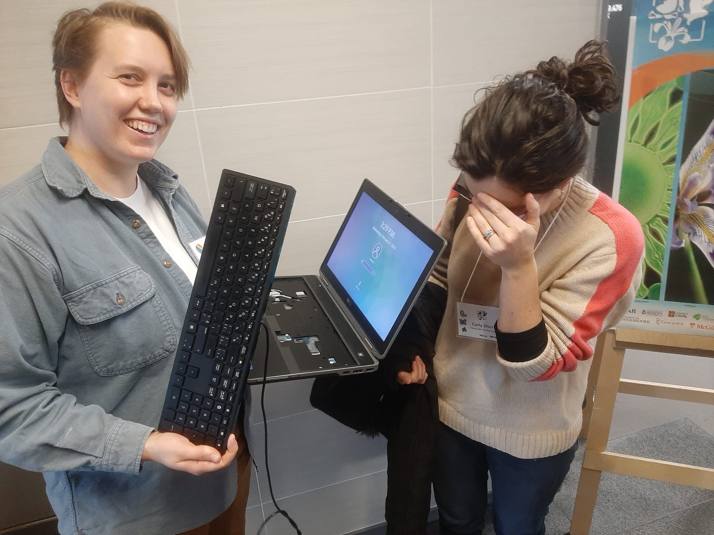{.absolute bottom="0" right="50"
width="300" height="400"}
:::

::::::: fragment
:::::: {layout="[[-1], [1], [-1]]"}
::::: columns
:::: {.column width="90%"}
::: {style="background-color: #c0c0beff; opacity: 80%"}
-   Carly & the ZULE lab

-   Committee members & examiners

-   Collaborators at UQAM, UdeM, Organisme Respire, UBC, McGill, MUN,
    uOttawa

-   Alec, Laura, Andrew, Anne-Sophie, and many more!

-   My friends and family
:::
::::
:::::
::::::
:::::::

## Nature is a key part of our cities

{fig-align="center"}

::: notes
-   novel ecosystem
-   inherently interdisciplinary
:::

## There are many benefits of urban nature, which are disproportionately provided by trees {.smaller}

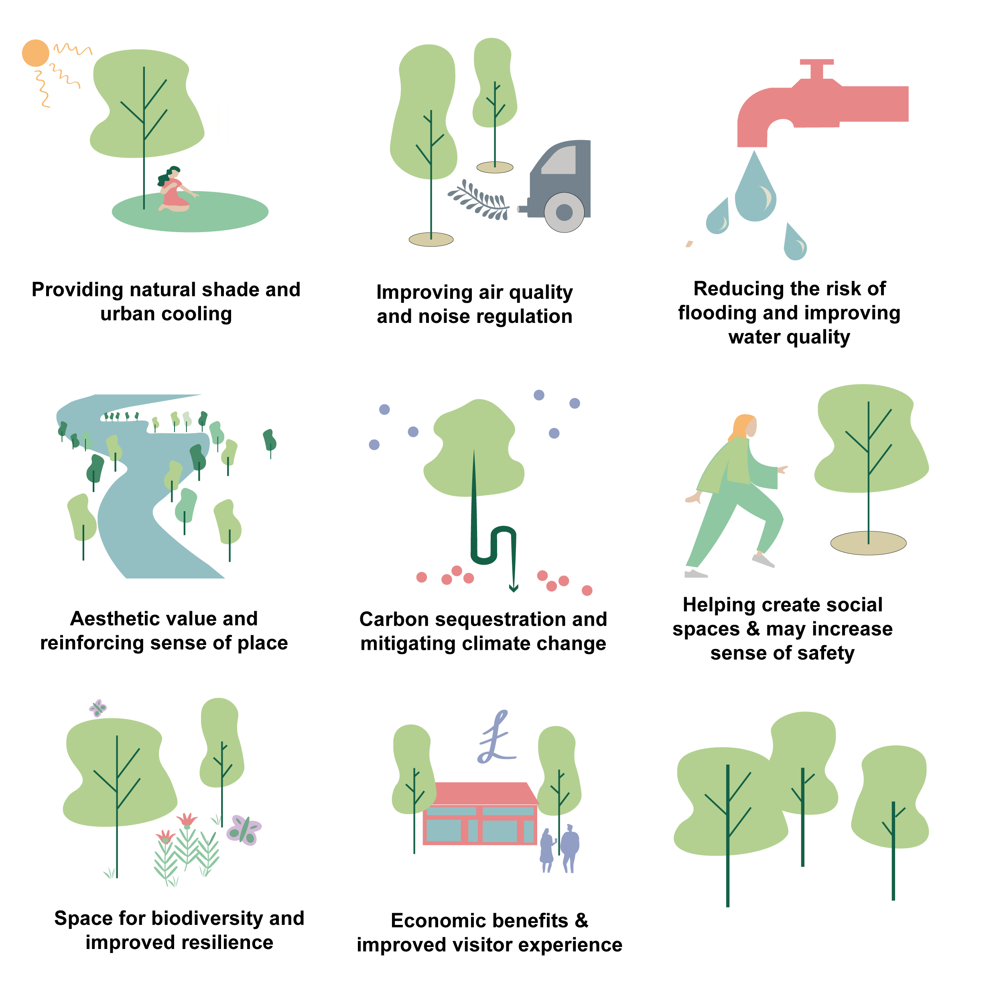

::: notes
-   ecosystem services - regulating & cultural
-   vary across spatial and temporal contexts
:::

## These benefits are not equitably distributed

:::::: columns
::: {.column width="50%"}
{width="350" height="475"
fig-align="center"}
:::

:::: {.column width="50%"}
::: {layout="[[-1], [1], [-1]]"}
-   Social processes underpin development
-   Spatial and temporal variation is present
-   Historical decisions continue to affect us
:::
::::
::::::

::: notes
-   decisions were made in the past, continue to affect our cities
-   affected by urban form and spatial context
:::

## These benefits are not equitably distributed

::::: columns
::: {.column width="50%"}
{width="350" height="475"
fig-align="center"}
:::

::: {.column width="50%"}
{width="450" height="450"
fig-align="center"}
:::
:::::

::: notes
-   decisions were made in the past, continue to affect our cities
-   affected by urban form and spatial context
:::

## Spatial patterns in nature's benefits are determined at multiple scales

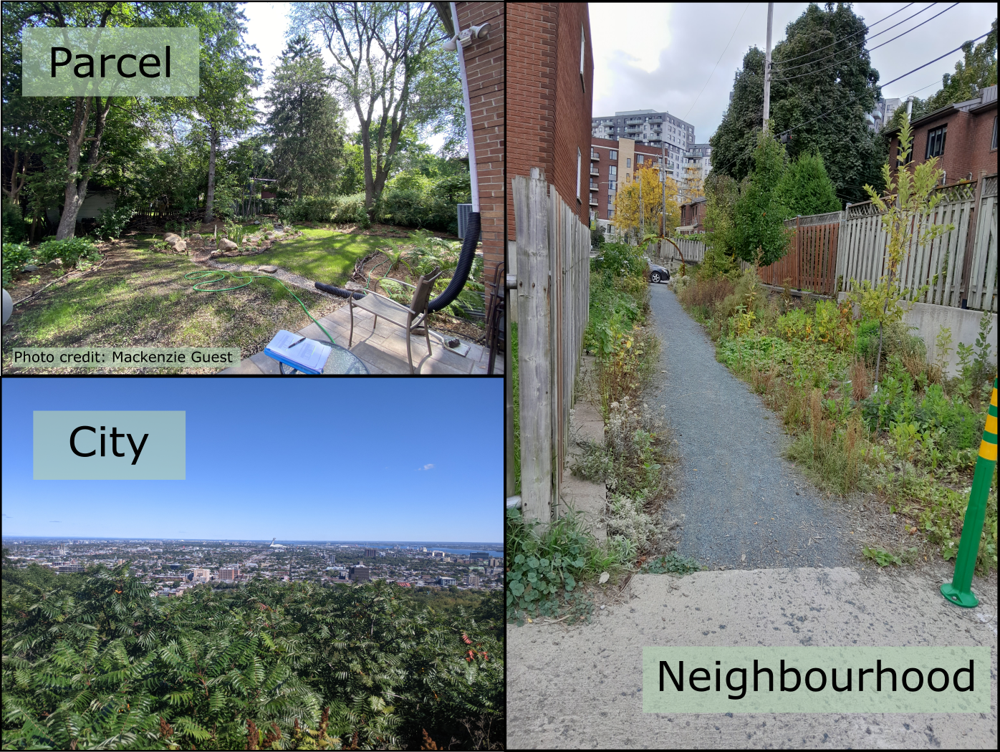{fig-align="center"}

## My thesis provides evidence that can be used for action

:::: incremental
::: {style="font-size: 150%;"}
1.  Integrate temporal heterogeneity and [**historical
    conditions**]{style="color:#006791;"}

2.  Use [**interdisciplinary**]{style="color:#006791;"} approaches and
    perspectives

3.  Assess benefits of [**understudied**]{style="color:#006791;"} types
    of green infrastructure

4.  Contribute a [**multi-scale**]{style="color:#006791;"},
    [**cross-city**]{style="color:#006791;"} study to the Canadian urban
    ecology literature
:::
::::

## Chapter 1: Land-use history causes differences in park nighttime cooling capacity and forest structure {.smaller}

::::::: {layout="[[-1], [1], [-1]]"}
:::::: columns
::: {.column width="33%"}
{fig-align="left"}
:::

::: {.column width="33%"}
{fig-align="center"}
:::

::: {.column width="33%"}
{fig-align="right"}
:::
::::::
:::::::

::: notes
-   cities are temporally dynamics
-   the redevelopment of urban spaces is a social process
:::

## We asked:

:::: incremental
::: {style="font-size: 150%;"}
1.  What are the effects of historical land-use on current park forest
    structure, diversity, and consequently the capacity to provide
    cooling?
2.  How do surrounding communities differ around parks of each
    historical land-use type, and what are the implications for
    equitable access to cooling?
:::
::::

## We uncovered the history of parks around Montréal

::: r-stack
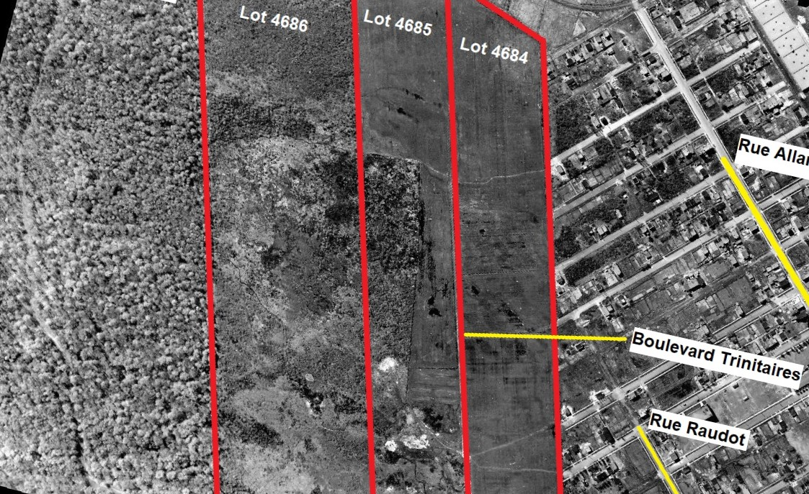{.fragment
width="80%" fig-align="center"}

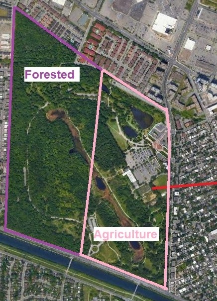{.fragment width="50%"
fig-align="center"}
:::

## We sampled temperature, forest structure, and population demographics in and around 27 parks {.smaller}

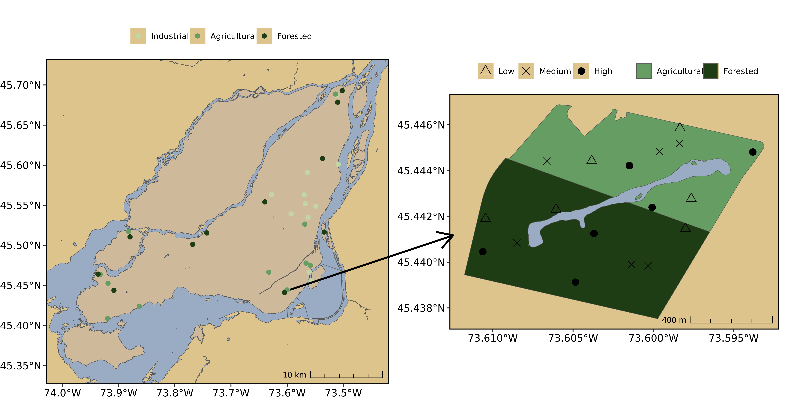{fig-align="center"}

## Past land-use affects park cooling capacity

:::::: columns
::: {.column width="70%"}
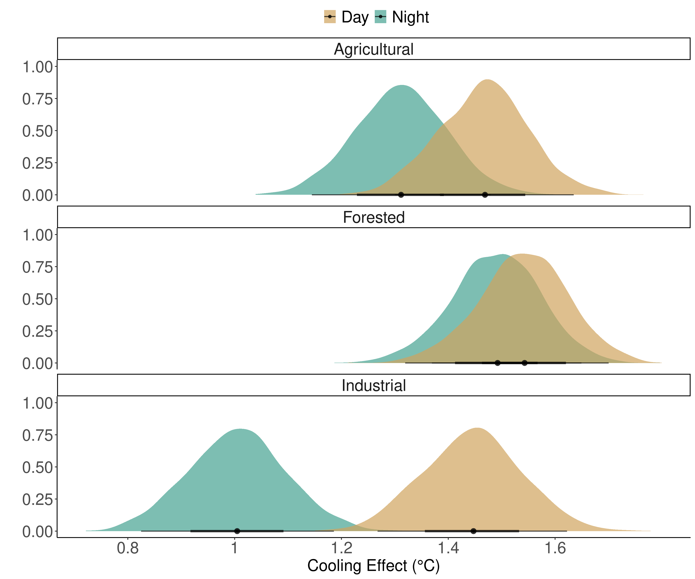{fig-align="left"
width="90%"}
:::

:::: {.column width="30%"}
::: {layout="[[-1], [1], [-1]]"}
-   Parks cool more during the day
-   Daytime cooling was similar across historical land-use types
-   Previously industrial sites cool less at night
:::
::::
::::::

## Past land-use affects forest structure

:::::: columns
::: {.column width="70%"}
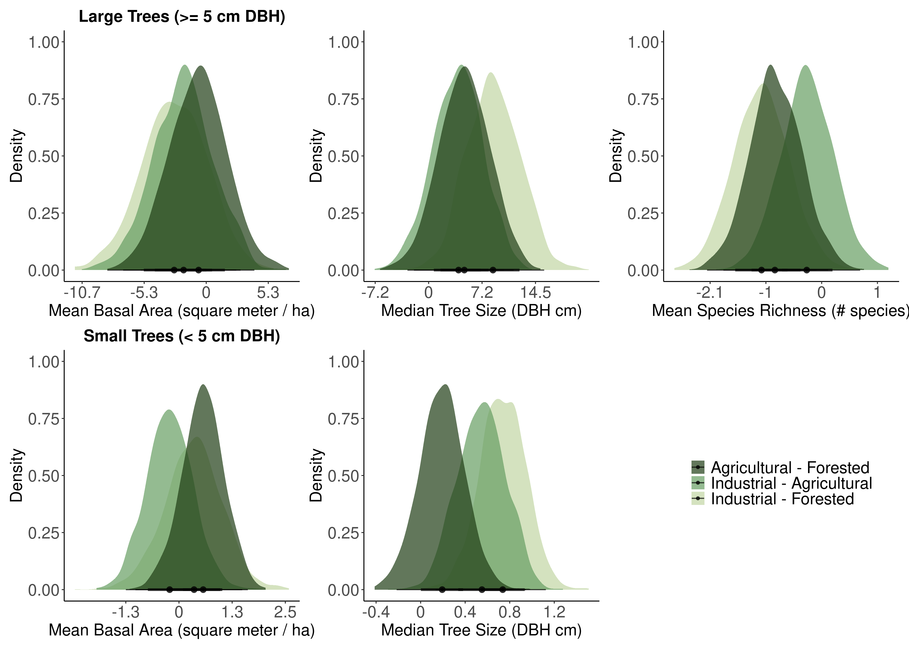{fig-align="left"
width="90%"}
:::

:::: {.column width="30%"}
::: {layout="[[-1], [1], [-1]]"}
-   Previously forested & agricultural sites had the highest mean basal
    area
-   Previously industrial sites had the largest mean tree size
-   Species richness was approximately the same
:::
::::
::::::

## Forest structure affects cooling

:::::: columns
::: {.column width="70%"}
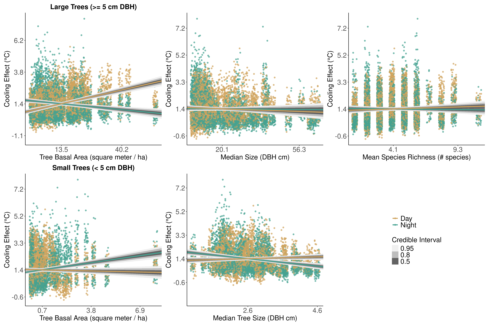{fig-align="left"
width="90%"}
:::

:::: {.column width="30%"}
::: {layout="[[-1], [1], [-1]]"}
-   Relationships between basal area and cooling are dependent on time
    of day and tree size
-   We see little effect of tree size or species richness on cooling for
    large trees
:::
::::
::::::

## The Luxury Effect surrounds our parks

::::: columns
:::: {.column .center}
::: fragment
**Across all parks:**

-   [⬆]{style="color:#CFA35E;"} level of education
-   [⬇]{style="color:#45A291;"} visible minorities
:::
::::
:::::

::::::: columns
:::: {.column width="50%"}
::: fragment
Forested 🌲 and agricultural 🌾

-   [⬆]{style="color:#CFA35E;"} median annual salary
-   [⬆]{style="color:#CFA35E;"} single family homes
:::
::::

:::: {.column width="50%"}
::: fragment
Industrial 🏭

-   [⬇]{style="color:#45A291;"} median annual salary
-   [⬇]{style="color:#45A291;"} single family homes
:::
::::
:::::::

## Put parks everywhere! ... with intentional, community led approaches

::::: columns
::: {.column width="50%"}
-   Historical data provides useful ecological context

-   Parks cool, regardless of historical land-use

-   To improve environmental equity, green space development must be
    community led and paired with stronger housing regulations
:::

::: {.column width="50%"}
{fig-align="right"}

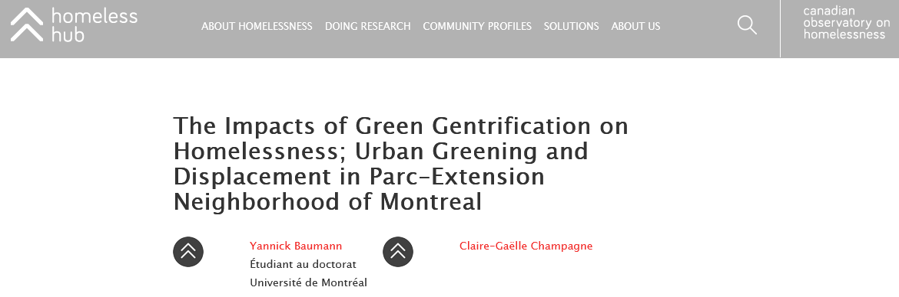{fig-align="right"}
:::
:::::

## Chapter 2: Green alleys in Quebec provide variable biodiversity support and ecosystem services {.smaller}

::::: columns
::: {.column width="50%"}
{fig-align="left"}

{fig-align="left"}
:::

::: {.column width="50%"}
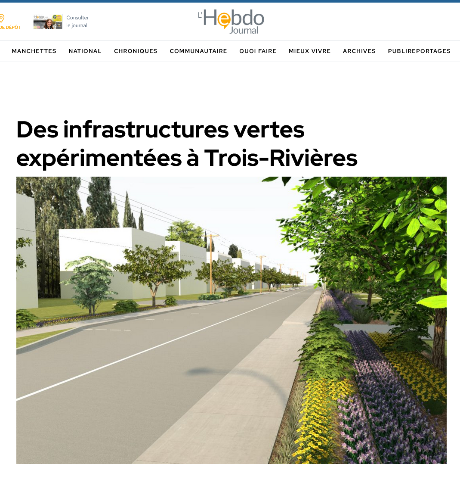{fig-align="right"}
:::
:::::

## 

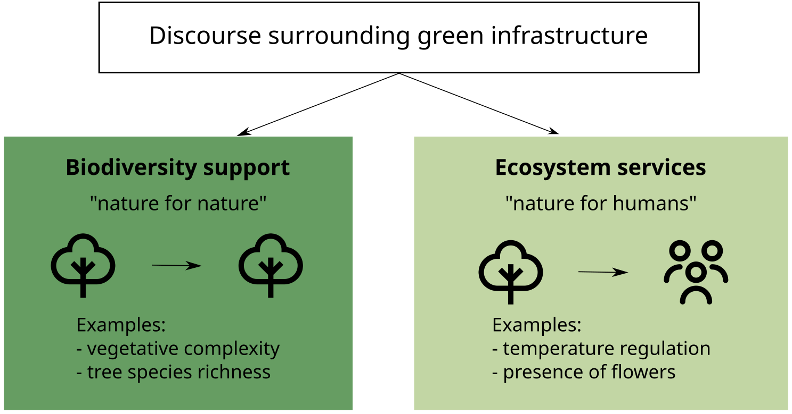

## We asked

:::::: columns
:::: {.column width="50%"}
::: incremental
1.  Do green alleys provide more **biodiversity support** than grey
    alleys or streets?

2.  Do green alleys provide more **ecosystem services** than grey alleys
    or streets?
:::
::::

::: {.column width="50%"}
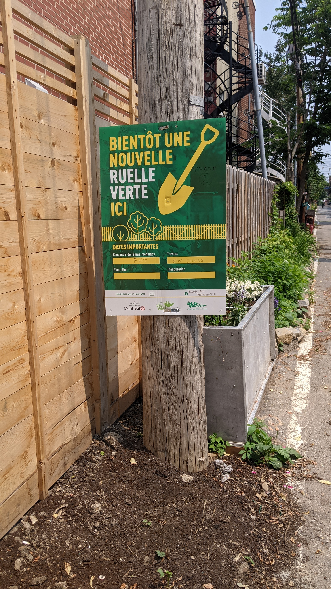{width="60%"}
:::
::::::

## We measured benefits in two ways

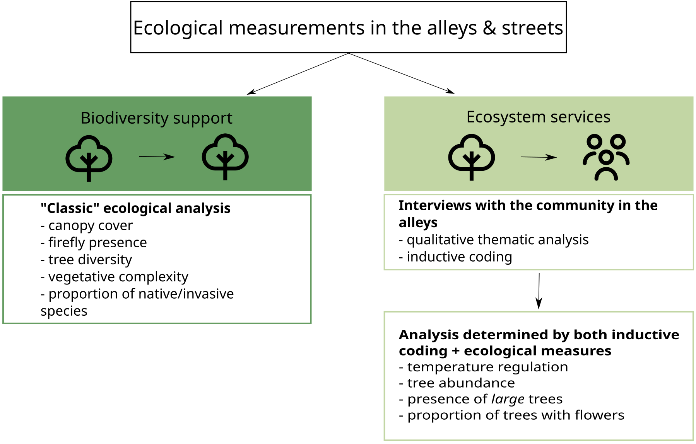

## Interview results

::::: columns
::: {.column width="40%"}
-   19 ecosystem services mentioned
-   Many of which are cultural
:::

::: {.column width="60%"}
```{r}
#| echo: false
#| eval: true
#| warning: false
#| message: false
#| label: table-s3

library(scales)
library(dplyr)
library(flextable)

interviews <- read.csv('presentation_imgs/es_coding.csv') %>% 
  select(-c(TotalPeopleMentions))

t <- col_bin("Greens", domain = 0:75)

interviews %>% 
  arrange(desc(TotalMentions)) %>% 
  flextable() %>% 
  bg(
    j = c("TotalMentions"),
    bg = t, part = "body"
  ) %>% 
  set_header_labels(
    EcosystemService = "Ecosystem service",
    TotalMentions = "Total number of mentions"
  ) %>%
  set_table_properties(
    opts_html = list(
      scroll = list(
      height = "500px",
      freeze_first_column = TRUE))
  ) %>% 
  fontsize(size = 18, part = 'all')


```
:::
:::::

## Green alleys have similar or higher levels of biodiversity support than grey alleys {.smaller}

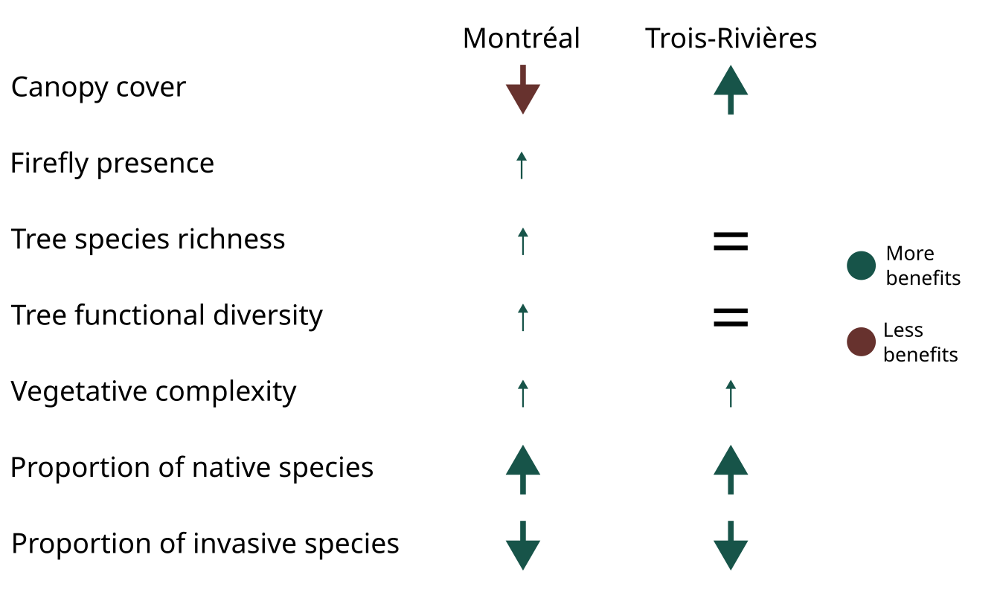{fig-align="center"}

## Green alleys have similar or lower levels of ecosystem services than grey alleys {.smaller}

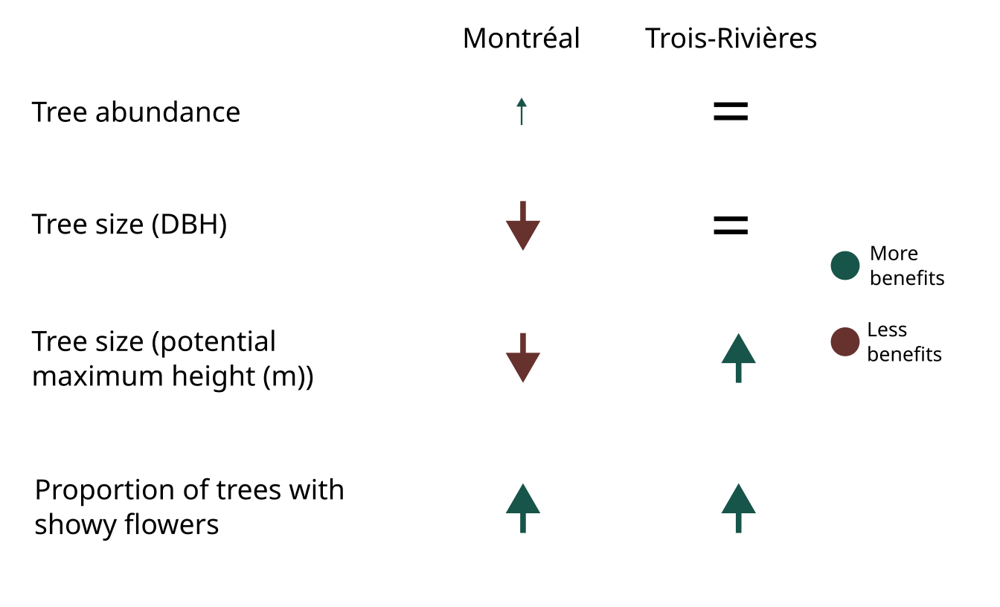{fig-align="center"}

## Temperature regulation is variable in Montréal

::::::: r-stack
:::::: columns
::: {.column width="75%"}
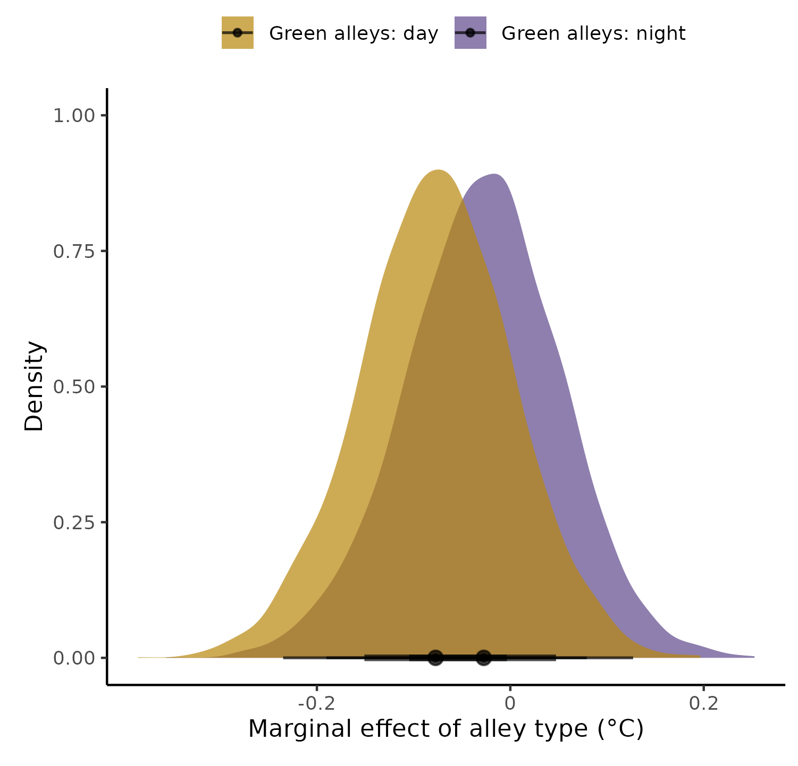{fig-align="left" width="75%"}
:::

:::: {.column width="25%"}
::: {layout="[[-1], [1], [-1]]"}
-   Green alleys are cooler during the day than at night
-   In Montreal, green alleys can be warmer or cooler than grey alleys
:::
::::
::::::

{.fragment fig-align="center"
width="55%"}
:::::::

## In Trois-Rivieres, green alleys cool at night

::::: columns
::: {.column width="70%"}
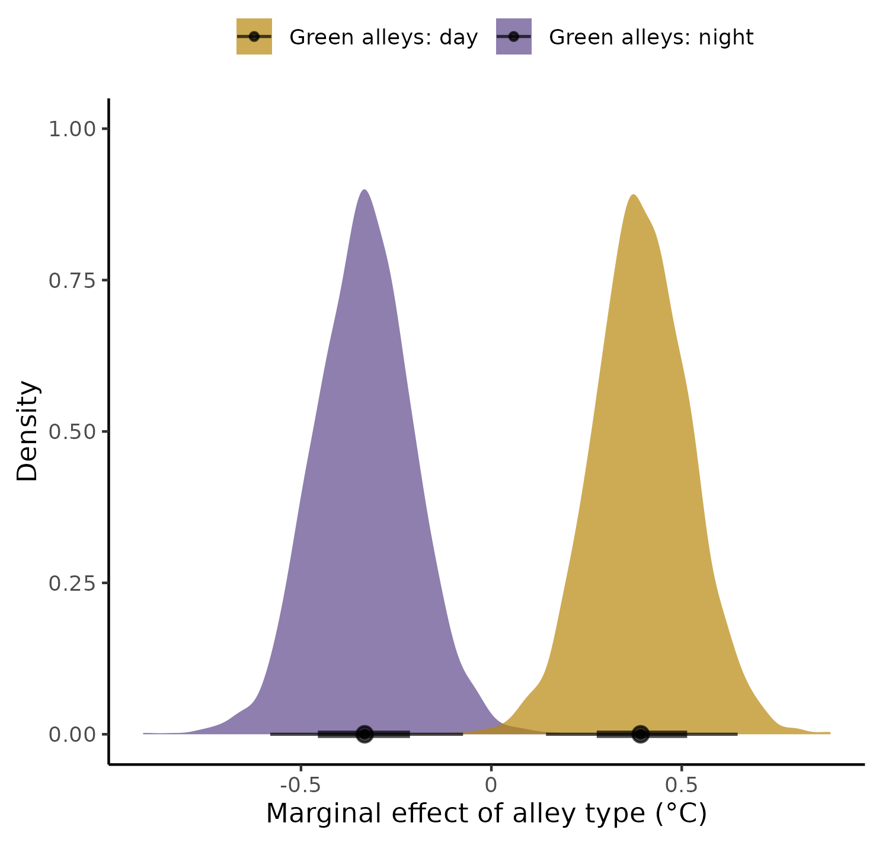{fig-align="left" width="80%"}
:::

::: {.column width="30%"}
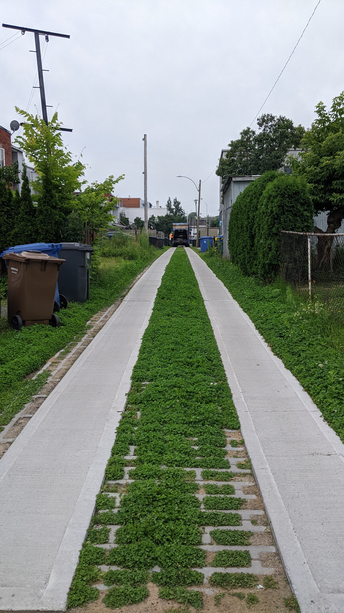{fig-align="right"}
:::
:::::

##  {background-image="presentation_imgs/dogwood.png"}

:::::: {layout="[[-1], [1], [-1]]"}
::::: columns
:::: {.column width="90%"}
::: {style="background-color: #c0c0beff; opacity: 80%"}
-   Green alleys are providing important benefits

-   Different management approaches result in different benefits

    -   Montréal is more variable and also more flexible
    -   TR is less variable but less able to adapt to resident needs

-   Right now, green alleys are providing more biodiversity support than
    ecosystem services with respect to **benefits provided by trees**

-   We recommend a bottom-up approach paired with **expert support** and
    **ongoing funding** to maximize the potential of green alleys
:::
::::
:::::
::::::

## Chapter 3: Predictors of land-surface temperature and air pollution across Canadian cities are largely scale and city dependent {.smaller}

::: fragment
{.absolute top="200" left="0"
width="600" height="200"}

{.absolute top="250" right="75"
width="400" height="100"}

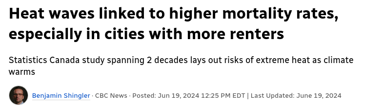{.absolute bottom="0" right="250"
width="600" height="250"}
:::

## Chapter 3: Predictors of land-surface temperature and air pollution across Canadian cities are largely scale and city dependent {.smaller}

{.absolute top="350" left="0" width="500"
height="100"}

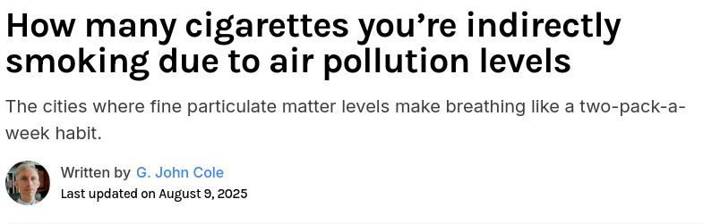{.absolute top="150" right="75"
width="600" height="200"}

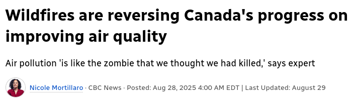{.absolute bottom="0" right="250"
width="600" height="200"}

## Cities are complex and novel ecosystems

{fig-align="center"}

## Cities are complex and novel ecosystems

](presentation_imgs/adapted-pickett.png){fig-align="center"}

## We asked

:::: incremental
::: {style="font-size: 150%;"}
1.  What is the relative contribution of street trees to predicting
    urban heat and air pollution at different scales when compared to
    urban form and sociodemographics?

2.  What are the relationships between important predictors of
    temperature and air pollution in different cities and across scales?
:::
::::

## We measured temperature, air pollution, ecological form, urban form, and sociodemographics across 7 Canadian cities {.smaller}

:::::: columns
::: {.column width="60%"}
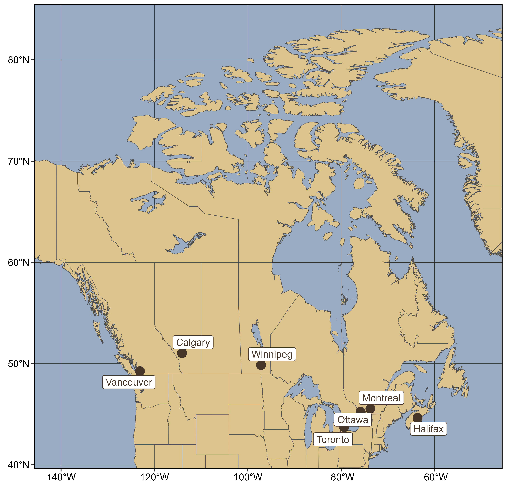{width="80%"}
:::

:::: {.column width="40%"}
::: {layout="[[-1], [1], [-1]]"}
-   Ecosystem service indicator: land surface temperature, air pollution
    (CO, NO2, SO2, UV, O3)

-   Ecological form: street tree diversity/size/density, greenness

-   Urban form: building cover/height, road size/density, greyness

-   Sociodemographics: income, race/ethnicity, immigration status,
    housing
:::
::::
::::::

## We measured our variables at multiple scales {.smaller}

-   Extracted at the most important predictors of temperature and air
    pollution across cities/scales
-   Assessed if there were generalizable patterns

{fig-align="center"}

## Inequity at the city scale was one of very few general predictors {.smaller}

::: {layout="[[-1], [1], [-1]]"}
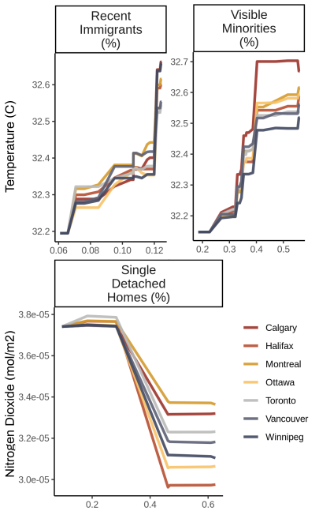{fig-align="center"}
:::

## Ecological form was an important predictor of temperature at the city and neighbourhood scales

::::::: columns
:::: {.column width="50%"}
::: fragment
City:

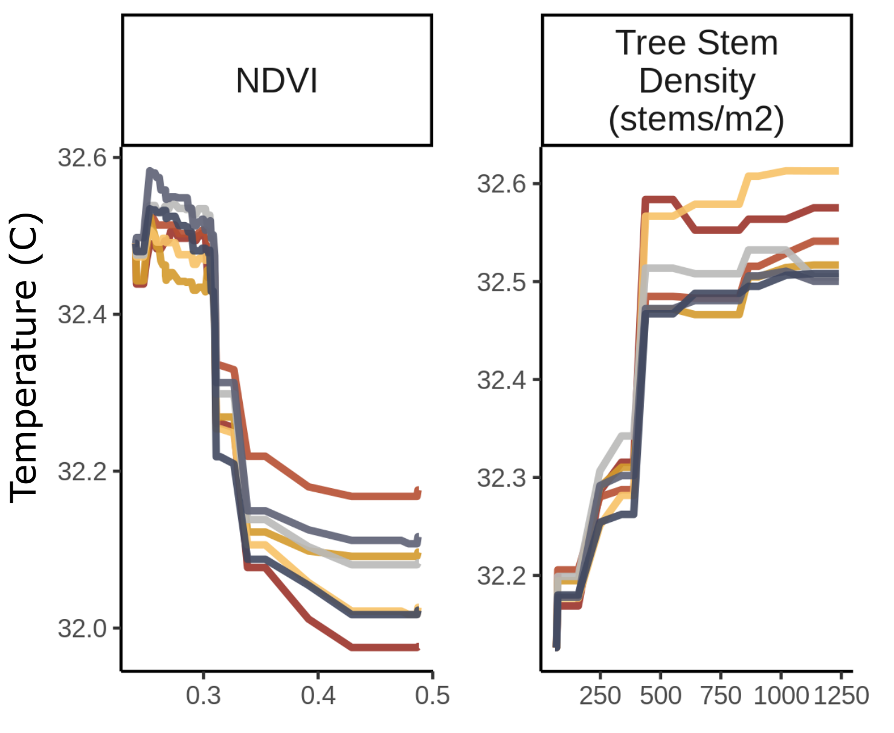{width="80%"}
:::
::::

:::: {.column width="50%"}
::: fragment
Neighbourhood:
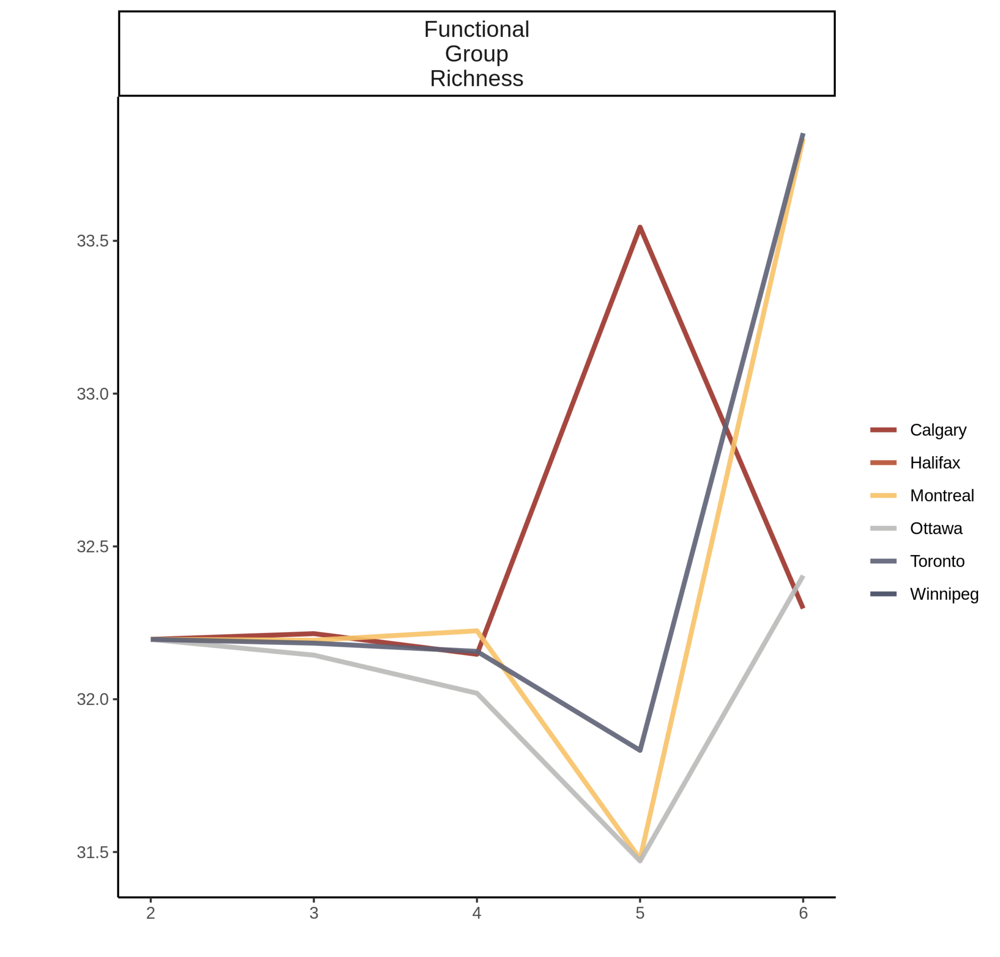{width="80%"}
:::
::::
:::::::

## Predictive models can help us identify areas for further research

:::::: incremental
::::: columns
::: column
-   We need to assess scale-specific interventions for temperature and
    air-pollution related issues in cities

-   Trees are most likely affecting the environmental conditions much
    more than is indicated in this study

-   More multi-scale, multi-service studies are needed in Canada
:::

::: column
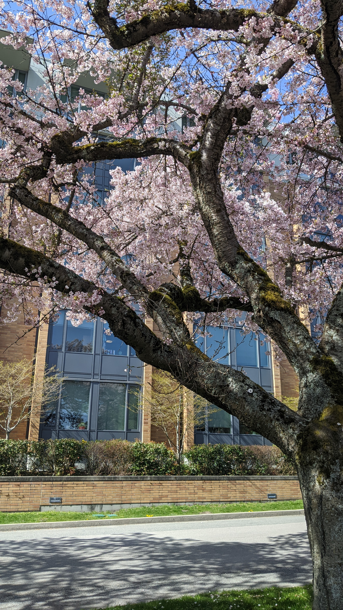{fig-align="right" width="50%"}
:::
:::::
::::::

##  {background-image="presentation_imgs/milkweed-2_sarahodriscoll_photography.jpg"}

:::::: {layout="[[-1], [1], [-1]]"}
::::: columns
:::: {.column width="90%"}
::: {style="background-color: #c0c0beff; opacity: 80%"}
**Thesis Take-Aways**

-   Integrating historical conditions facilitates understanding of
    current conditions

-   Spatial scale is of critical importance when discussing nature's
    benefits

-   Small, unconventional green infrastructure types are deserving of
    our attention

-   Interdisciplinary work improves our ability to respond to the needs
    of people
:::
::::
:::::
::::::

##  {background-image="presentation_imgs/tnoc-p19.jpg"}

## Chapter 1 DAG

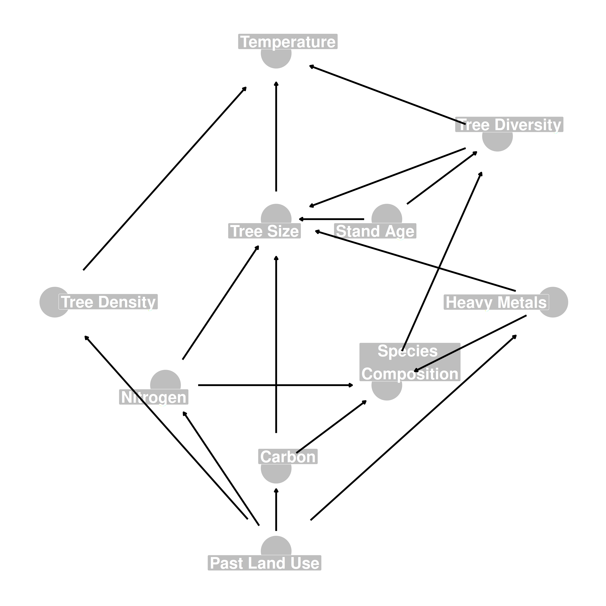{fig-align="center"}

## Chapter 2 - example DAG

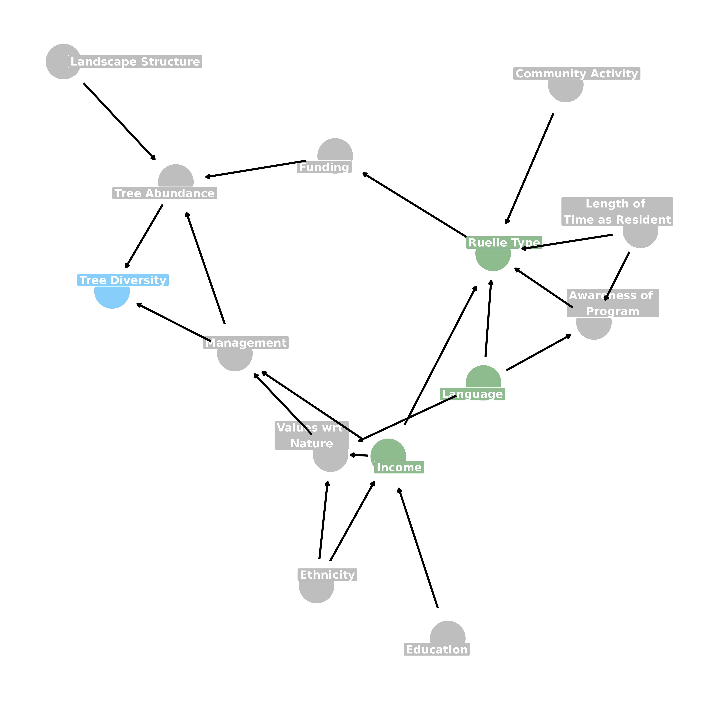{fig-align="center"}

## Chapter 2 - ecological benefits DAGS

{fig-align="center"}

## Chapter 2 - ecosystem services DAGs

{fig-align="center"}

## Green alleys as a case study

::::::: columns
:::: {.column width="60%"}
::: {layout="[[-1], [1], [-1]]"}
-   Increase biodiversity

-   Increase ecological connectivity

-   Reduce heat island effect

-   Improve air quality

-   Provide habitat for small mammals, birds, and insects
:::
::::

:::: {.column width="40%"}
::: {layout="[[-1], [1], [-1]]"}
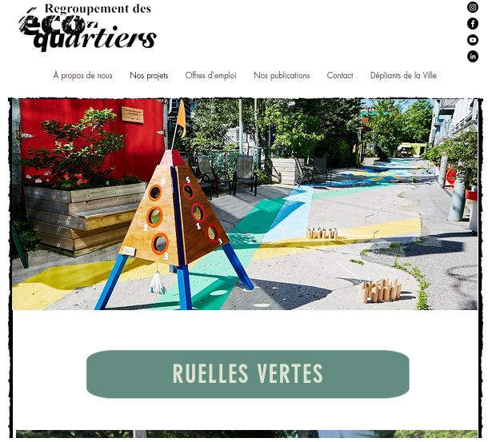{fig-align="left"}
:::
::::
:::::::

## Interviewee demographics

```{r}
#| echo: false
#| eval: true
#| warning: false
#| message: false
#| label: interviewees

library(tidyr)

interviewees <- read.csv('presentation_imgs/participant_profiles.csv')

df <- interviewees %>% 
  select(c(Variable, Levels, Count)) %>% 
  drop_na(Count)

df %>% 
  group_by(Variable) %>% 
  mutate(Percent =  round(100 *Count/sum(Count), 0)) %>% 
  ungroup() %>%
  flextable() %>%
  set_table_properties(
  opts_html = list(
    scroll = list(
      height = "500px",
      freeze_first_column = TRUE
    )))

```

## Random forest modelling

```{r}
#| echo: false
#| eval: true
#| warning: false
#| message: false
#| label: example-rf-data

rf <- read.csv('presentation_imgs/cities_temp.csv')


rf %>% 
  select(-X) %>% 
  flextable() %>%
  set_table_properties(
  opts_html = list(
    scroll = list(
      height = "500px",
      freeze_first_column = TRUE
    )))

```

